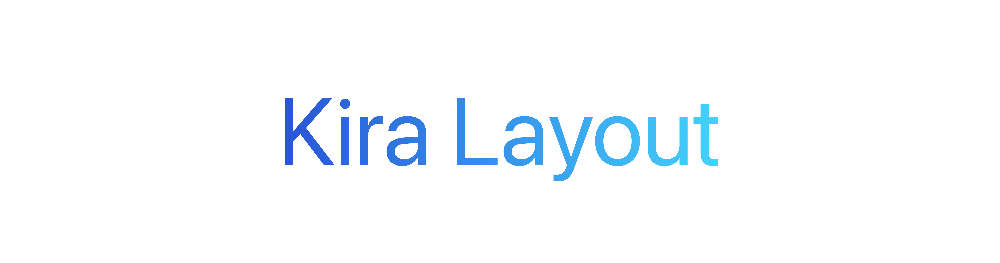

<picture>
  <source media="(prefers-color-scheme: dark)" srcset="Images/KiraLayoutBannerDark.png">
  <source media="(prefers-color-scheme: light)" srcset="Images/KiraLayoutBannerLight.png">
  
</picture>

# KiraLayout

A modern, type-safe layout engine for the Kira programming language. Provides a two-pass measurement and placement algorithm with support for flexible sizing modes, multiple arrangement strategies, and comprehensive geometric utilities.

## Features

- **Two-Pass Algorithm**: Measure bottom-up, place top-down for predictable layout computation
- **Flexible Sizing**: Fixed, Fill, Hug, Fraction, Min, and Max sizing modes
- **Arrangement Strategies**: Stack (row/column), Grid, Wrap, Absolute, Overlay, and Fill layouts
- **Comprehensive Utilities**: Geometry operations for Points, Sizes, Rects, and EdgeInsets
- **Type-Safe**: Leverages Kira's static typing for correctness
- **Modular Structure**: Clean separation of concerns with organized file structure

## Directory Structure

```
app/
├── Primitives/       # Core geometry types (Point, Size, Rect, EdgeInsets)
├── Layout/           # Layout types, arrangements, and node models
├── Utils/            # Utility functions for geometric operations
└── Engine/           # Layout engine with measure/place algorithm
```

## Quick Start

### Build

```bash
kira check
```

### Run Example

```bash
cd examples/small-layout-test
kira run
```

The example demonstrates all geometry operations with clean, formatted output showing calculations for points, sizes, rectangles, and edge insets.

## Core Types

### Primitives

- **Point**: 2D coordinate (x, y)
- **Size**: Dimensions (width, height)
- **Rect**: Rectangle (x, y, width, height)
- **EdgeInsets**: Spacing (top, trailing, bottom, leading)

### Layout

- **Axis**: Horizontal / Vertical
- **SizeMode**: Fixed | Fill | Hug | Fraction | Min | Max
- **ArrangeMode**: Stack | Grid | Wrap | Absolute | Overlay | Fill
- **LayoutNode**: Tree node with descriptor, children, measured size, and placed origin

## API Overview

### Geometry Utilities

```kira
// Points
pointDistance(p1: Point, p2: Point) -> Float
pointOffset(p: Point, dx: Float, dy: Float) -> Point

// Sizes
sizeArea(s: Size) -> Float
sizeScale(s: Size, factor: Float) -> Size

// Rects
rectCenter(r: Rect) -> Point
rectContains(r: Rect, point: Point) -> Bool
rectIntersects(r: Rect, other: Rect) -> Bool
rectInset(r: Rect, by: EdgeInsets) -> Rect
rectRight(r: Rect) -> Float
rectBottom(r: Rect) -> Float

// EdgeInsets
edgeInsetsHorizontalTotal(insets: EdgeInsets) -> Float
edgeInsetsVerticalTotal(insets: EdgeInsets) -> Float
edgeInsetsTotal(insets: EdgeInsets) -> Float
```

### Layout Engine

```kira
struct LayoutEngine {
    function measure(node: LayoutNode, available: Size) -> Size
    function place(node: LayoutNode, origin: Point)
}
```

## Example Output

```
=====================================
  KIRA LAYOUT ENGINE - DEMO
=====================================

[ POINTS ]
-------------------------------------
  Point 1: (10, 15)
  Point 2: (25, 35)
  Manhattan Distance: 35
  p1 offset by (5, 10): (15, 25)

[ SIZES ]
-------------------------------------
  Size: 100 x 50
  Area: 5000
  Scaled 2x: 200 x 100

[ RECTANGLES ]
-------------------------------------
  Rect origin: (10, 20) size 100 x 60
  Center: (60, 50)
  Edges - Right: 110 | Bottom: 80
  Test point (50, 40) inside: true
  After inset (5T, 10R, 5B, 10L): 80 x 50

[ EDGE INSETS ]
-------------------------------------
  Values - Top: 5 | Trailing: 10 | Bottom: 5 | Leading: 10
  Totals - Horizontal: 20 | Vertical: 10
  Grand total: 30

=====================================
  All demos completed successfully!
=====================================
```

## Implementation Notes

- The layout engine currently performs basic content-hugging sizing. SizeMode resolution can be extended to support all sizing strategies.
- Arrangement logic (Stack, Grid, Wrap) is defined as types and ready for implementation in the measure/place passes.
- The modular structure allows independent development and testing of each component.

## License

MIT
