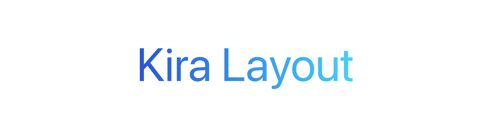

<picture>
  <source media="(prefers-color-scheme: dark)" srcset="Images/KiraLayoutBannerDark.png">
  <source media="(prefers-color-scheme: light)" srcset="Images/KiraLayoutBannerLight.png">
  
</picture>

# KiraLayout

A modern, type-safe layout engine for the Kira programming language. It provides a two-pass measurement and placement algorithm with flexible sizing modes, multiple arrangement strategies, and geometry utilities.

## Features

- **Two-Pass Algorithm**: Measure bottom-up, place top-down for predictable layout computation
- **Flexible Sizing**: Fixed, Fill, Hug, Fraction, Min, and Max sizing modes
- **Arrangement Strategies**: Stack, Grid, Wrap, Absolute, Overlay, and Fill layouts
- **Spacing Support**: Padding, margin, stack spacing, row spacing, and stretch alignment
- **Frame Inspection**: Retrieve final node frames from a measured and placed tree
- **Geometry Utilities**: Operations for Points, Sizes, Rects, and EdgeInsets

## Directory Structure

```text
app/
├── Primitives/       # Core geometry types
├── Layout/           # Descriptors, node/tree model, arrangement enums
├── Utils/            # Geometry helper functions
└── Engine/           # Two-pass layout engine and sizing helpers
```

## Quick Start

```bash

These commands want **`kk`**, the native frontend of the
[Kira Language Framework](https://github.com/kira-lang-com/klf-kira), which
`klf build .` produces in that repository. `kk`'s binary is also called `kira`,
so the two are told apart by which one is on your `PATH`, not by the name you
type. The oracle compiler from
[kira-lang-com/kira](https://github.com/kira-lang-com/kira) aborts partway
through semantic analysis on this codebase.

kira check
kira test --backend vm tests/layout_kik
kira test --backend llvm tests/layout_kik
```

The suite lays out real trees and reads the resulting frames back, on both backends.

## Core Types

- **Point**: 2D coordinate
- **Size**: Width and height
- **Rect**: Origin plus size
- **EdgeInsets**: Top, trailing, bottom, and leading spacing
- **SizeMode**: Fixed, Fill, Hug, Fraction, Min, Max
- **ArrangeMode**: Stack, Absolute, Grid, Wrap, Overlay, Fill
- **LayoutNode**: Flat tree node with descriptor, measured size, placed origin, and child range
- **LayoutTree**: Executable node storage used by the layout engine

## Layout Engine

```kira
struct LayoutEngine {
    function measure(tree: LayoutTree, index: Int, available: Size) -> LayoutTree
    function place(tree: LayoutTree, index: Int, origin: Point) -> LayoutTree
}
```

`measure` and `place` return updated trees. This matches Kira's current value-oriented execution model and avoids relying on reference mutation for nested nodes.

## Implementation Notes

- `SizeMode.Fixed` and `SizeMode.Fill` resolve as outer sizes.
- `SizeMode.Hug`, `Min`, and `Max` include content plus padding.
- A child that fills contributes nothing to a parent that sizes from its content: it is resolved against the parent's final size during placement, from the leftover main-axis space or from the container on the cross axis.
- Stack, Absolute, Grid, Wrap, Overlay, and Fill are implemented in both measure and place.
- The tree is flat (`LayoutTree.nodes` plus `firstChild` / `childCount`) because current executable Kira does not accept empty array literals for leaf child lists.
- Integer-to-float layout math goes through the `intAsFloat` helper, now a single `Float(...)` numeric cast (the compiler gained `Int(...)`/`Float(...)` casts).

## License

Licensed under the Apache License, Version 2.0 ([LICENSE](LICENSE) or http://www.apache.org/licenses/LICENSE-2.0).
